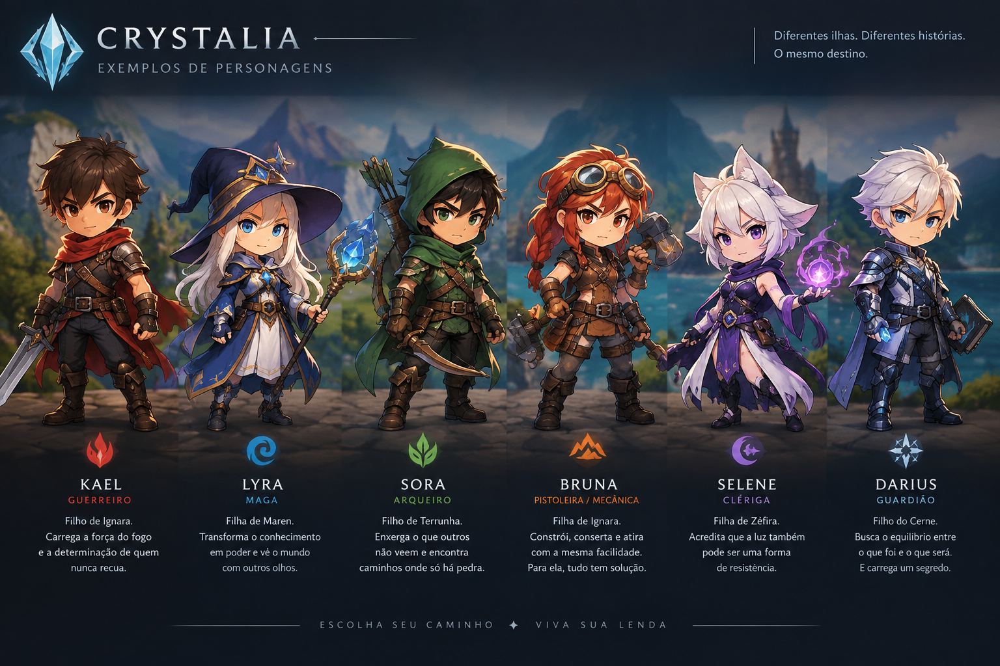
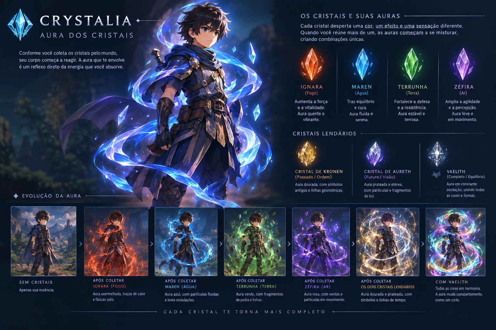

# 🔥 Crystalia

**Um MMORPG-lite brasileiro em desenvolvimento aberto:** quatro ilhas-elemento,
poderes chamados **Dons**, quests com consequência — e um **servidor
autoritativo de verdade** desde a primeira linha de código (o cliente nunca
decide dano, cooldown nem posição; quem decide é o servidor, 20 vezes por
segundo).

> Estado atual: **Fase 1 — MVP "Ignara"** 🏗️ · fundação técnica e combate
> autoritativo ✅ · **servidor em produção + demo web ao vivo abaixo 👇** ·
> **23 testes verdes** · guard rails de servidor autoritativo (issue #18) ·
> ver etapas completas em [`docs/ROADMAP.md`](docs/ROADMAP.md)

---

## 🎨 Conceitos do mundo





_(Arte conceitual — o MVP de verdade hoje usa sprites desenhados por IA já_
_plugados na ilha de Ignara. Cada cristal desperta uma aura; cada escolha_
_muda a sua.)_

---

## 🎮 Demo ao vivo — jogue agora

**→ [admirable-raindrop-103ea1.netlify.app](https://admirable-raindrop-103ea1.netlify.app/?name=Crystal)** _(troque `?name=Crystal` pelo seu nome de aventureiro!)_

**Novo (09/2026): o site virou um webapp próprio** — `webapp/` — com landing
épica, menu de visitante e a ilha de Ignara em canvas (sprite real do Kael,
aura de fogo, cristais rosa, poças de lava, projéteis autoritativos). O
**servidor autoritativo entrega o próprio jogo** na raiz: um deploy só
(Render) traz página + WebSocket same-origin.

- 🤝 **Multiplayer real**: abra duas abas com nomes diferentes e veja os
  personagens aparecerem um para o outro em tempo real (servidor autoritativo
  na Render — `wss://crystalia-server.onrender.com`).
- 🔥 **Dom de Fogo v1.1**: agora é um **projétil decidido no servidor** (custo
  25 de energia, cooldown 700ms, dano 25 na colisão). O cliente só desenha.
- 🔌 Se o servidor estiver cochilando no free tier, o jogo **reconecta sozinho
  (12 tentativas)** e, sem resposta, cai no **MODO DEMO local** — a ilha abre
  offline com recrutas de treino para esparramar Dom.
- 📱 **Celular e desktop**: joystick virtual + botão 🔥 no toque; WASD +
  Espaço/E no teclado. `Esc` volta ao menu.

> Deploy contínuo ligado: o site atualiza sozinho a cada push na main
> (Netlify ↔ GitHub, publicando `webapp/`). Para trocar o servidor alvo:
> `webapp/config.js` ou `?server=wss://…` na URL. Detalhes em
> [`docs/DEPLOY.md`](docs/DEPLOY.md). O export Godot antigo segue em `web/`
> como legado.

---

## 🗣️ Sua opinião importa — feedback aberto

Crystalia está sendo construído em público. Queremos ouvir **você**:

- O que funcionou bem na demo?
- O que quebrou ou ficou confuso?
- Ideias de mecânicas, quests, NPCs ou história?
- Sugestões visuais (auras, ilhas, personagens, efeitos)?
- Qualquer bug ou desejo de feature?

**Como mandar:**
1. Abra uma [Issue](https://github.com/deividjmoura/crystalia_game/issues/new) com a label `feedback` (ou só descreva livremente).
2. Ou use as [Discussions](https://github.com/deividjmoura/crystalia_game/discussions) do repositório (quando ativadas) para ideias e conversa.
3. Pode também comentar direto no README / PR se preferir.

Toda sugestão séria é lida pelo time (humano + agentes). A direção de arte e o roadmap evoluem com o que a comunidade traz.

> _“Cada cristal desperta uma aura; cada escolha muda a sua.”_ — e cada feedback muda o jogo.

---

## 🕹️ Como jogar

- **WASD** mover **·** **ESPAÇO/E** = Dom de Fogo (projétil autoritativo:
  custo 25, cooldown 700ms — decididos no servidor)
- No celular: joystick virtual à esquerda, botão 🔥 (ou toque) à direita
- Duas abas ao mesmo tempo = ver multiplayer espelhando em tempo real 🪞
- Sem servidor? O **MODO DEMO** te recebe com a ilha inteira desenhada —
  e devolve o multiplayer quando ele acorda. `Esc` volta ao menu.

> Devs/agentes: instruções completas de run em **docs/DEPLOY.md** e as regras
> do time em [AGENT_SYNC.md](AGENT_SYNC.md). O README aqui é vitrine 😉

---

## 🏗️ Arquitetura

```
┌──────────────┐        WebSocket JSON          ┌───────────────┐
│  Cliente     │   { type: "move_input", ... }   │   Servidor    │
│  Godot 4.7.2 │ ───────────────────────────────►│  Node + `ws`  │
│  (render +   │                                 │  tick 20/s    │
│   previsão)  │ ◄───────────────────────────────│  IgnaraRoom   │
└──────────────┘   estado final (pos/HP/energia) └─┬─────────────┘
                                                   │ (Fase 1.6)
                                            ┌──────▼──────┐
                                            │  Supabase   │  auth + Postgres
                                            │  (conta)    │  schema pronto
                                            └─────────────┘
```

**Padrão de ouro:** o cliente manda *intenções* (`move_input`, `use_dom_fogo`);
o servidor calcula resultado, aplica **cooldown/custo/dano** e devolve o
estado confirmado — com reconciliação visual no cliente (`lerp`). Detalhes e
porquês em [`docs/STRUCTURE.md`](docs/STRUCTURE.md).

---

## 🗂️ Estrutura do repositório

```
crystalia_game/
├── godot-client/         # Jogo (Godot 4.7.2)
│   ├── scenes/           # World, Player (.tscn — 1 agente por cena, ver AGENT_SYNC)
│   └── scripts/          # NetworkManager, Player, World, FireEffect, web/WebBridge
├── server/               # Servidor autoritativo (Node + ws + express health)
│   └── src/game/IgnaraRoom.js
├── database/
│   └── supabase_schema.sql
├── web/                  # Build web exportado (Netlify) + config.js em runtime
├── docs/                 # ROADMAP · STRUCTURE · DEPLOY · PROTOCOL · ART_DIRECTION · CAMERA_AND_3D · ACHIEVEMENTS
├── AGENT_SYNC.md         # 🤖 quadro do time de agentes (ler antes de mexer!)
├── render.yaml           # Deploy blueprint (Render)
└── netlify.toml          # Headers do build web (wasm/pck com cache)
```

---

## 🛠️ Stack

| Camada | Tecnologia | Por quê |
|---|---|---|
| Cliente | **Godot 4.7.2** (GDScript) | exporta Web + Mobile da mesma base |
| Rede | WebSocket puro, JSON `{type}` | SDK Colyseus Godot 4 é experimental — fora do MVP (ver STRUCTURE) |
| Servidor | Node 20 + `ws` + Express (`/health`) | autoritativo desde o protótipo |
| Conta | **Supabase** (auth + Postgres) | plano gratuito hosteam, SQL aberto |
| Deploy | Netlify (web) + Render (server) | dois deploys, zero acoplamento |

---

## 👥 Quem constrói

- **Deivid** — direção de jogo, mundo, infra e tudo que é decisão humana.
- **Equipe de agentes** (coordenada por [`AGENT_SYNC.md`](AGENT_SYNC.md)) —
  engenharia, testes, CI, docs, visual. Agentes: leiam o quadro **antes** de abrir
  qualquer editor; claims são a lei.
- **Achievements** (farm legítimo): painel em [`docs/ACHIEVEMENTS.md`](docs/ACHIEVEMENTS.md) · contadores oficiais em [github.com/deividjmoura?tab=achievements](https://github.com/deividjmoura?tab=achievements).

---

## 🗺️ O que vem agora

- NPC **Tomrik** com diálogo · 12 quests de Ignara · cristais comuns
- Supabase auth + persistência de quest no servidor
- **Bragmar, o Forjador Caído** (boss) e o barco que encerra a trilha 🔥

Trilha completa: [`docs/ROADMAP.md`](docs/ROADMAP.md) — e depois, o
_Fase 2 — Mundo Base_.
